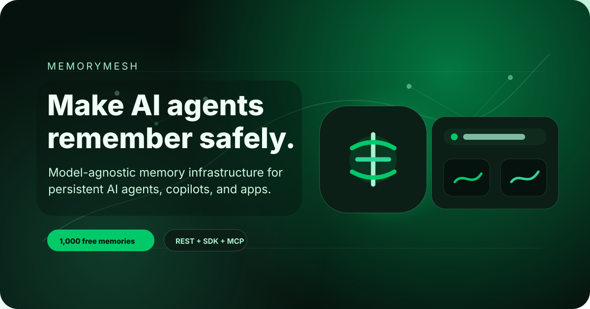
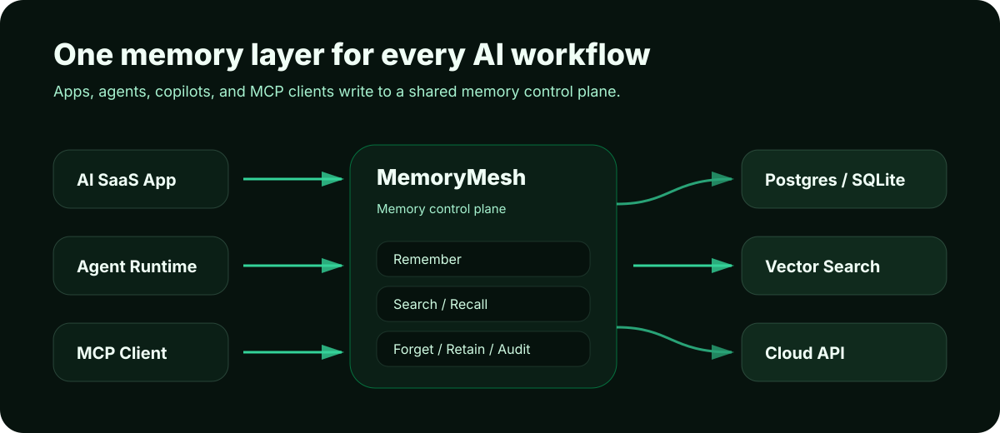

<p align="center">
  
</p>

<h1 align="center">MemoryMesh</h1>

<p align="center"><strong>Make your AI agents remember — safely.</strong></p>

<p align="center">Model-agnostic memory infrastructure for persistent AI agents, copilots, and AI-native apps.</p>

<p align="center">
  <a href="https://aiprofithub.ai/memorymesh"><strong>Join Cloud waitlist</strong></a>
  ·
  <a href="#quick-start"><strong>Quick start</strong></a>
  ·
  <a href="#use-the-sdk"><strong>SDK</strong></a>
  ·
  <a href="#architecture"><strong>Architecture</strong></a>
</p>

---

## Why MemoryMesh?

AI agents can answer one prompt, but most of them forget the user, the project, the last decision, and the previous agent handoff.

MemoryMesh gives every agent a shared, permissioned memory layer through REST, a TypeScript SDK, and an MCP server scaffold.

> Free for experiments. Paid when memory becomes mission-critical.

---

## Architecture

<p align="center">
  
</p>

```txt
Apps / Agents / MCP Clients
        ↓
MemoryMesh API + SDK + MCP Server
        ↓
Memory Core: remember, search, forget, retain, audit
        ↓
Storage adapters: local, SQLite, Postgres, vector search, cloud
```

---

## Quick start

```bash
pnpm install
pnpm dev
```

```bash
curl http://localhost:4310/health
```

---

## Store a memory

```bash
curl -X POST http://localhost:4310/v1/memories \
  -H "content-type: application/json" \
  -d '{
    "userId": "user_123",
    "agentId": "agent_sales",
    "type": "preference",
    "content": "User prefers concise execution steps in Thai.",
    "tags": ["preference", "thai", "execution"]
  }'
```

---

## Use the SDK

```ts
import { createMemoryMeshClient } from "@memorymesh/sdk";

const memory = createMemoryMeshClient({
  baseUrl: "http://localhost:4310"
});

await memory.remember({
  userId: "user_123",
  agentId: "agent_founder",
  type: "decision",
  content: "Launch MemoryMesh as an open-source memory layer with a hosted cloud option.",
  tags: ["decision", "launch", "pricing"]
});

const context = await memory.search({
  userId: "user_123",
  query: "What launch strategy did the user choose?"
});

console.log(context);
```

---

## Open source vs Cloud

| Feature | Open Source | Cloud Free | Builder | Team |
|---|---:|---:|---:|---:|
| Local memory API | Yes | Yes | Yes | Yes |
| TypeScript SDK | Yes | Yes | Yes | Yes |
| MCP server | Yes | Yes | Yes | Yes |
| Hosted memory storage | No | Yes | Yes | Yes |
| Memories included | Local | 1,000 | 10,000 | 100,000 |
| Search requests | Local | 100/day | 2,000/day | 20,000/day |
| Projects | Local | 1 | 3 | 10 |
| Agents | Local | 1 | 3 | 20 |
| Team workspace | No | No | No | Yes |
| Audit log | Basic | No | Basic | Advanced |

---

## Cloud waitlist

Want a hosted endpoint for your agents?

```txt
https://aiprofithub.ai/memorymesh
```

Cloud Free is planned to include one hosted project, one API key, 1,000 memories, 100 searches per day, 30-day retention, REST API, SDK, and MCP access.

---

## License

MIT
